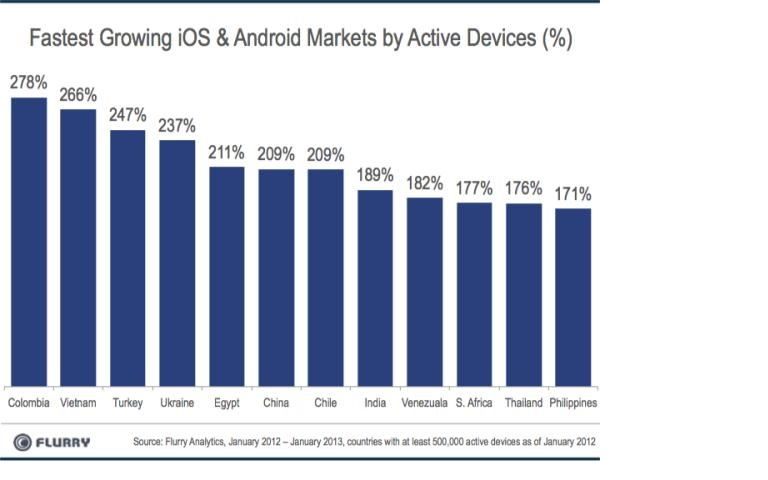
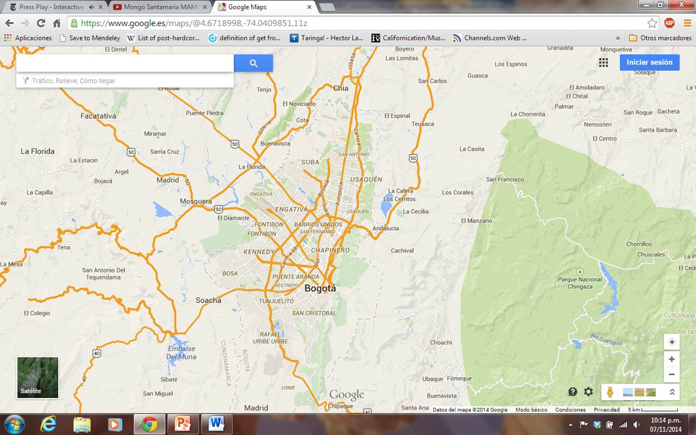
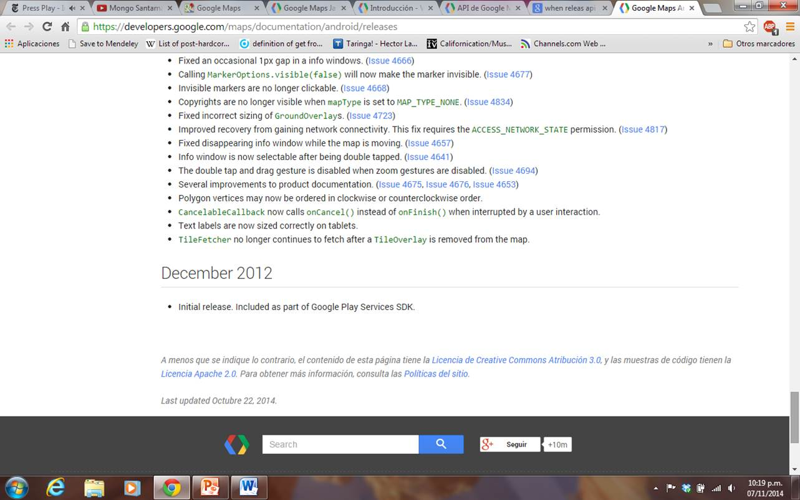
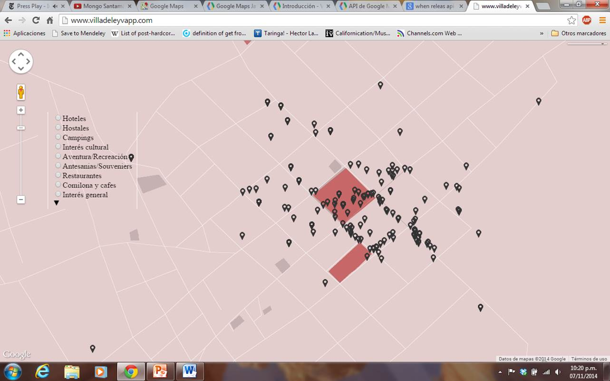
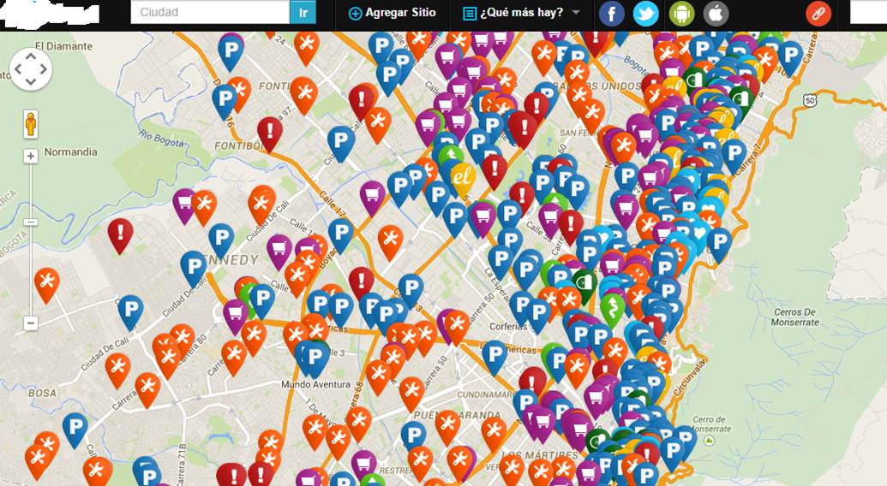

<!-- configuracion de colores es opcional pero ultil-->
<section id="themes">
	<h2>Configuración de temas</h2>
	

		Temas:  
		<a href="?#/themes">Default</a> -
		<a href="?theme=sky#/themes">Sky</a> -
		<a href="?theme=beige#/themes">Beige</a> -
		<a href="?theme=simple#/themes">Simple</a> -
		<a href="?theme=serif#/themes">Serif</a> -
		<a href="?theme=night#/themes">Night</a>  
		<a href="?theme=moon#/themes">Moon</a> -
		<a href="?theme=solarized#/themes">Solarized</a>
	

</section>

Slide:

#Propuesta Trabajo 
#Final de Maestría

* Por Diego Alejandro Uscategui Russi

Slide:

#Apps Moviles

### [Fuente: Flurry from Yahoo! 2013](http://www.flurry.com/bid/94352/China-Knocks-Off-U-S-to-Become-World-s-Top-Smart-Device-Market#.VEk7OfmG87E)

Slide:

#Google Maps

Slide:

#Pregunta de 
#Investigación

* Desde esta industria surge una pregunta de investigación: 
* ¿Qué oportunidades nos permiten identificar las necesidades que pueden encontrar colaboración con la elaboración de aplicaciones móviles (apps) cooperativas y de información compartida por los actores sociales en Colombia?  

Slide:

##Api Android Google Maps

Slide:

##Proyecto 1 VilladeLeyvapp

Slide:
##Proyecto 2 Bogota

Slide:
##Monetizar SL

* Sobresaliente
* Banners
* Pushing

Slide:
#GITHUB

Slide:
##Avance Proyecto

* Crear dos Apps para el Sector Turismo con información abierta y colaborativa.
* Gratuitas para el Usuario y Para el comercio.
* Su «chinche» es gratuito.
* Creando métricas de medida de impacto.
* Posibilidad de generar Mas ciudades con mismo esquema.

Slide:
##Preguntas, observaciones, 
##Colaboraciones…?
* https://github.com/Uskategi
* http://uskategi.blogspot.com/

Slide:
##Referencias
* Hoe Hong, Y., Heng Teh, B., & Hooi Soh, C. (2014). Acceptance of Smart Phone by Younger Consumers in Malaysia. Asian Social Science, 10(6), 34–39. 
* Aldhaban, F. (2012). Exploring the Adoption of Smartphone Technology : Literature Review. In PICMET ’12 (pp. 2758–2770).
* Karnowski, V., & Jandura, O. (2014). When lifestyle becomes behavior: A closer look at the situational context of mobile communication. Telematics and Informatics, 31(2), 184–193.
* Suominen, A., Hyrynsalmi, S., & Knuutila, T. (2014). Young mobile users: Radical and individual – Not. Telematics and Informatics, 31(2), 266–281. 

Slide:
##Referencias
* Yamakawa, P., Delgado, C., Díaz, E., Garayar, E., & Laguna, H. (2013). Factors Influencing the Use of Mobile Technologies in a University Environment. International Journal of Information and Communication Technology Education, 9(2), 24–38.
* Chemingui, H., & Lallouna, H. Ben. (2013). Resistance, motivations, trust and intention to use mobile financial services. International Journal of Bank Marketing, 31(7), 574–592.
* Shin, D.-H. (2009). Towards an understanding of the consumer acceptance of mobile wallet. Computers in Human Behavior, 25(6), 1343–1354. 

Slide:
##Referencias
* Mallat, N., Rossi, M., Tuunainen, V. K., & Öörni, A. (2009). The impact of use context on mobile services acceptance: The case of mobile ticketing. Information & Management, 46(3), 190–195.
* Thakur, R., & Srivastava, M. (2014). Adoption readiness, personal innovativeness, perceived risk and usage intention across customer groups for mobile payment services in India. Internet Research, 24(3), 369–392. 
* Christensen, C. (1997). Innovator ’ s Dilemma (pp. 1–179).
* Tornatzky, L. G., & Klein, K. J. (1982). Innovation characteristics and innovation adoption-implementation: A meta-analysis of findings. IEEE Transactions on Engineering Management, EM-29(1), 28–45. 

Slide:
##Referencias
* Al-Ansari, Y., Pervan, S., & Xu, J. (2013). Innovation and business performance of SMEs: the case of Dubai. Education, Business and Society: Contemporary Middle Eastern Issues, 6(3), 162–180.
* HAMEED, M. A., & COUNSELL, S. (2014). ESTABLISHING RELATIONSHIPS BETWEEN INNOVATION CHARACTERISTICS AND IT INNOVATION ADOPTION IN ORGANISATIONS: A META-ANALYSIS APPROACH. International Journal of Innovation Management, 18(01), 1450007. 

Slide:
##Referencias
* Nan, N., Zmud, R., & Yetgin, E. (2013). A complex adaptive systems perspective of innovation diffusion: an integrated theory and validated virtual laboratory. Computational and Mathematical Organization Theory, 20(1), 52–88. 
* SHI, X., & FERNANDES, K. (2014). EXPLORING THE ROLE OF INNOVATIVENESS AND OPINION LEADERSHIP IN DIFFUSION. International Journal of Innovation Management, (2), 1450029.
* Sie, R.L.L. , Bitter-Rijpkema, M. , Stoyanov, S. , Sloep, P.B. (2014). Factors that influence cooperation in networks for innovation and learning. Computers in Human Behavior.

Slide:
##Referencias
* Rajat Kumar Agarwal, Amit Sedai, Sunil Dhimal, Kumari Ankita, Luigi Clemente, Sulman Siddique, Naila Yaqub, Sadaf Khalid, Fatima Itrat, Anwar Khan, Sarah Khan Gilani, Priya Marwah, Rajpreet Soni, Mohamed El Missiry, Mohamed Hamed Hussain, Cornelio Uderzo, Lawrence Faulkner (2014). A prospective international cooperative information technology platform built using open-source tools for improving the access to and safety of bone marrow transplantation in low- and middle-income countries. Journal of the American Medical Informatics Association.

Slide:
##Referencias
* Ministerio de Tecnologías de la Información y las Comunicaciones. Convocatoria para proyectos de innovación para Sector Turismo [en línea]: documenting electronic sources on the Internet. 2014 [fecha de consulta: 15 Noviembre 2014]. Disponible en: http://www.mintic.gov.co/portal/604/w3-article-7181.html

Slide:
##Referencias
* Departamento Administrativo de Ciencia, Tecnología e Innovación Colciencias. Convocatoria para el desarrollo de soluciones innovadoras de TI aplicadas en el sector de turismo en Colombia - 2014 680. [en línea]: documenting electronic sources on the Internet. 2014 [fecha de consulta: 15 Noviembre 2014]. Disponible en: http://www.colciencias.gov.co/convinno14

Slide:
##Referencias
* Departamento Administrativo de Ciencia, Tecnología e Innovación Colciencias. COLCIENCIAS Y MINTIC BUSCAN SOLUCIONES INNOVADORAS DE TI PARA APLICARLAS EN EL TURISMO. 2014 [en línea]: documenting electronic sources on the Internet. 2014 [fecha de consulta: 15 Noviembre 2014]. Disponible en: http://www.colciencias.gov.co/noticias/colciencias-y-mintic-buscan-soluciones-innovadoras-de-ti-para-aplicarlas-en-el-turismo 
